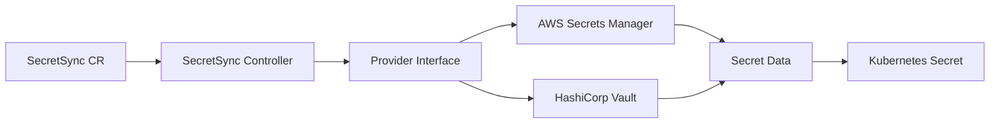
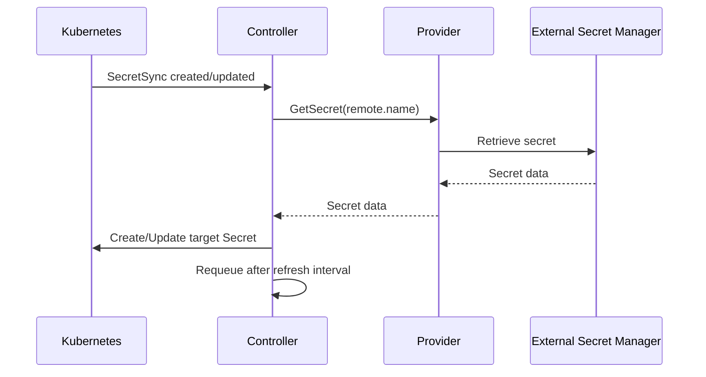
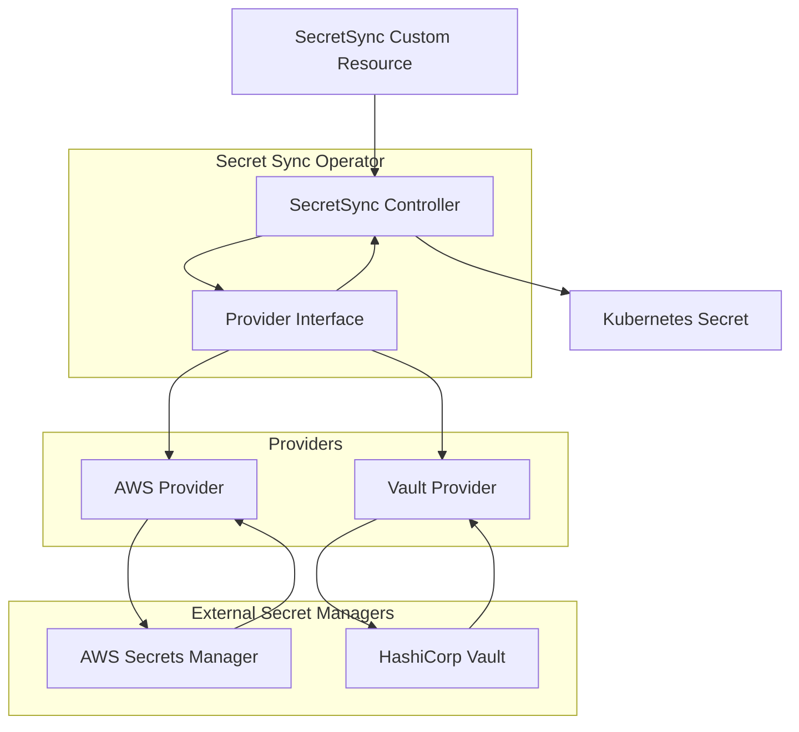
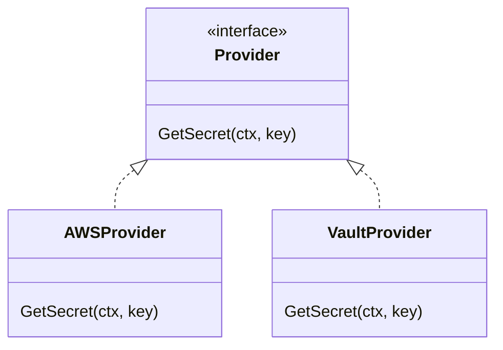
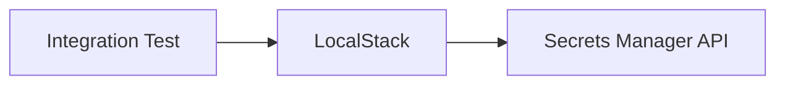
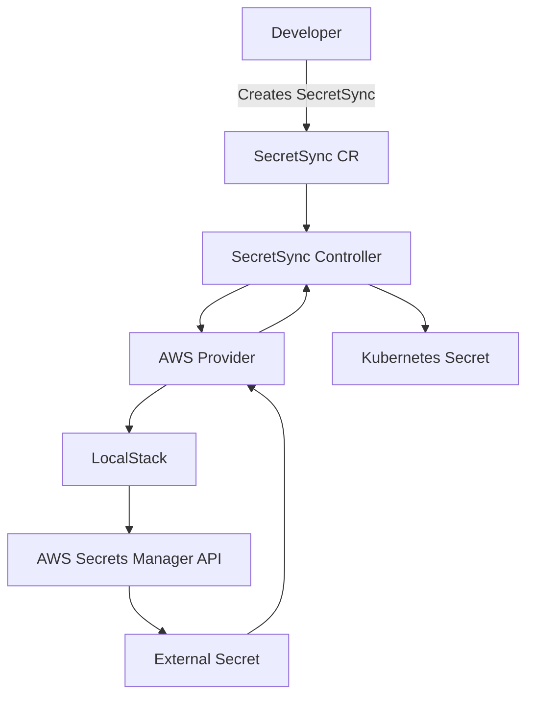
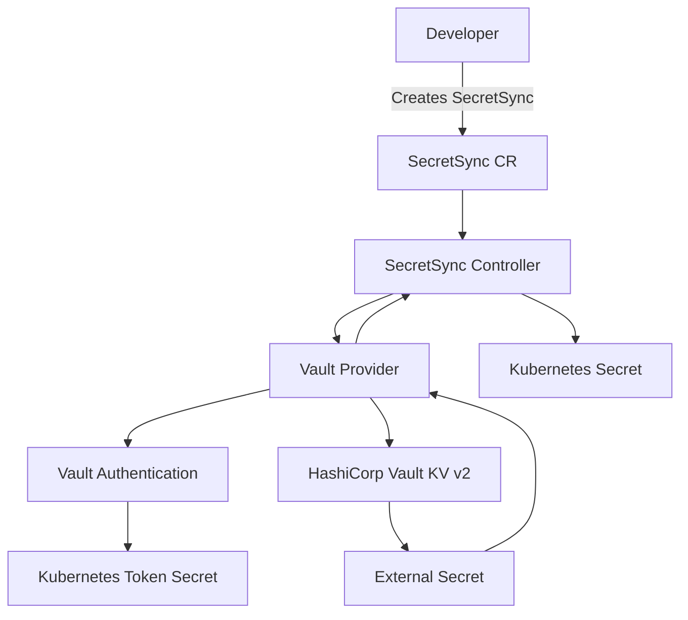
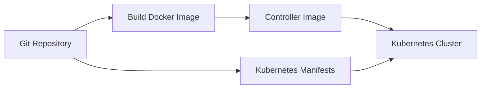

# Secret Sync Operator

A Kubernetes operator that synchronizes secrets from external secret management systems into Kubernetes `Secret` resources.

The project is built with **Go**, **Kubernetes**, and **Kubebuilder**, with a provider abstraction that allows support for multiple external secret providers.

Currently supported:

* **AWS Secrets Manager**
* **HashiCorp Vault (KV v2)** with **token authentication**

---

## Overview

The **Secret Sync Operator** watches `SecretSync` custom resources and synchronizes secrets from an external provider into a Kubernetes `Secret`.

The goal is to provide a simple Kubernetes-native way to reference externally managed secrets without storing the original secret values in the `SecretSync` resource.



The controller is designed around a provider interface so that adding another secret management system does not require changing the core reconciliation logic.

---

<!-- CHANGED: New architectural explanation. -->

## Why a CRD and Operator Instead of a CronJob?

A periodic synchronization task could be implemented using a Kubernetes `CronJob`. However, this project uses a **Custom Resource Definition (CRD) and Kubernetes controller** because the synchronization is modeled as a continuously managed Kubernetes resource rather than as a scheduled batch job.

With a `CronJob`, the schedule is the primary abstraction:

```text
CronJob
   │
   ├── starts Job
   │
   └── Job retrieves secret
          │
          └── updates Kubernetes Secret
```

With the operator, the desired synchronization is represented directly as a Kubernetes resource:

```text
SecretSync CR
      │
      ▼
SecretSync Controller
      │
      ├── retrieves external secret
      │
      ├── compares desired state
      │
      └── creates/updates Kubernetes Secret
```

This approach provides several advantages:

### Declarative configuration

The `SecretSync` resource describes the desired relationship:

* which provider to use
* which external secret to retrieve
* which Kubernetes Secret should contain the data
* how frequently the resource should be refreshed

The synchronization configuration becomes part of the Kubernetes API rather than being embedded in a scheduled script or Job.

### Continuous reconciliation

Kubernetes controllers are designed around reconciliation: the controller repeatedly compares the desired state with the current state and takes action when they differ.

For example, if the target Kubernetes Secret is deleted manually, the controller can recreate it during the next reconciliation.

Similarly, if the external secret changes, the controller can update the Kubernetes Secret during its next refresh.

### Event-driven and periodic behavior

The controller can react to Kubernetes events such as creation or modification of a `SecretSync`, while also periodically rechecking the external secret.

The `refreshInterval` field controls the periodic reconciliation interval:

```yaml
spec:
  refreshInterval: 10m
```

If `refreshInterval` is not specified, the controller uses a default interval of **5 minutes**.

This combines Kubernetes event-driven reconciliation with periodic synchronization of an external system.

### Kubernetes-native resource model

A `SecretSync` can be inspected and managed using normal Kubernetes tooling:

```bash
kubectl get secretsync
kubectl describe secretsync database-sync
kubectl get secretsync database-sync -o yaml
```

The synchronization status is also reported through the `SecretSync` status and its `Ready` condition.

### Separation of scheduling from synchronization logic

A `CronJob` primarily answers:

> "When should this Job run?"

The operator instead models:

> "This external secret should continuously be synchronized into this Kubernetes Secret."

The controller owns the synchronization lifecycle and can determine whether an update is actually necessary before modifying the target Secret.

A `CronJob` remains a valid solution for simpler one-off or scheduled tasks. The CRD/operator approach is used here because the synchronization itself is treated as a Kubernetes resource with a desired state that should continuously be reconciled.

---

## How It Works

A `SecretSync` resource defines:

1. **Which provider** should be used.
2. **Which external secret** should be retrieved.
3. **Which Kubernetes Secret** should contain the synchronized data.
4. **How frequently** the external secret should be checked.

For example:

```yaml
apiVersion: ops.example.com/v1alpha1
kind: SecretSync
metadata:
  name: database-sync
spec:
  refreshInterval: 10m

  provider:
    type: aws

  remote:
    name: production/database

  target:
    name: database-secret
```

The reconciliation flow is:



If the target Secret already contains the desired data, the controller does not update it.

The controller periodically reconciles the resource according to `spec.refreshInterval`. If no interval is specified, a default interval of **5 minutes** is used.

---

# Custom Resource

The operator introduces the following custom resource:

```yaml
apiVersion: ops.example.com/v1alpha1
kind: SecretSync
```

### Example

```yaml
apiVersion: ops.example.com/v1alpha1
kind: SecretSync
metadata:
  name: database-sync
  namespace: default
spec:
  refreshInterval: 10m

  provider:
    type: aws

  remote:
    name: production/database

  target:
    name: database-secret
```

### Specification

| Field                  | Description                                                                             |
| ---------------------- | --------------------------------------------------------------------------------------- |
| `spec.refreshInterval` | Optional interval between periodic reconciliations. Defaults to 5 minutes when omitted. |
| `spec.provider.type`   | External secret provider to use                                                         |
| `spec.provider.config` | Optional provider-specific configuration                                                |
| `spec.remote.name`     | Name/key of the secret in the external provider                                         |
| `spec.target.name`     | Name of the Kubernetes `Secret` to create/update                                        |

The target Kubernetes `Secret` is created in the **same namespace as the `SecretSync` resource**.

Provider configuration is passed to the provider implementation, allowing each provider to determine how its configuration and authentication should be handled.

### Refresh Interval

The `refreshInterval` field controls how frequently the controller rechecks the external secret.

For example:

```yaml
spec:
  refreshInterval: 10m
```

Supported Kubernetes duration values can be used, such as:

```yaml
refreshInterval: 5m
refreshInterval: 10m
refreshInterval: 1h
```

If the field is omitted, the controller uses a default refresh interval of **5 minutes**.

The interval affects periodic reconciliation. The controller can also reconcile immediately when Kubernetes events trigger reconciliation, such as when the `SecretSync` resource is created or modified.

---

# Project Architecture

The project separates Kubernetes reconciliation from provider-specific implementations.



The important design principle is the **provider abstraction**.

The controller does not need to know how AWS Secrets Manager or Vault works. It only interacts with the provider interface.

This makes it possible to add new providers without changing the core reconciliation logic.

---

# Repository Structure

The project follows the standard Kubebuilder layout:

```text
secret-sync-operator/

├── api/
│   └── v1alpha1/
│       ├── secretsync_types.go
│       └── zz_generated.deepcopy.go
│
├── cmd/
│   └── main.go
│
├── config/
│   ├── crd/
│   ├── default/
│   ├── manager/
│   ├── rbac/
│   └── samples/
│
├── deploy/
│   └── vault/
│       └── docker-compose.yml
│
├── internal/
│   ├── controller/
│   │   ├── secretsync_controller.go
│   │   └── secretsync_controller_test.go
│   │
│   └── provider/
│       ├── provider.go
│       ├── factory.go
│       ├── aws.go
│       ├── aws_test.go
│       ├── vault.go
│       ├── vault_auth.go
│       ├── vault_auth_test.go
│       └── vault_integration_test.go
│
├── test/
│   ├── e2e/
│   │   ├── e2e_suite_test.go
│   │   ├── e2e_test.go
│   │   └── vault.go
│   └── utils/
│
├── Dockerfile
├── Makefile
├── Makefile.go.mk
├── go.mod
├── go.sum
└── README.md
```

---

# Provider Interface

The provider layer abstracts access to external secret management systems.

The controller interacts with the provider rather than directly calling AWS, Vault, or another external system.

Conceptually:

```go
type Provider interface {
    GetSecret(ctx context.Context, key string) (map[string][]byte, error)
}
```

Current implementations include:



This keeps provider-specific code isolated from the Kubernetes controller.

---

# AWS Secrets Manager

The current implementation supports **AWS Secrets Manager**.

The AWS provider retrieves the secret using the AWS SDK for Go and expects the secret to contain a JSON object with string values.

For example, an AWS Secrets Manager secret could contain:

```json
{
  "username": "admin",
  "password": "example-password",
  "host": "database.example.com"
}
```

The operator converts these values into the Kubernetes Secret's `data` fields.

Conceptually:

```text
AWS Secrets Manager

        │
        │ GetSecretValue
        ▼

{
  "username": "admin",
  "password": "example-password",
  "host": "database.example.com"
}

        │
        ▼

Kubernetes Secret
        │
        ├── username
        ├── password
        └── host
```

### AWS Configuration

The AWS provider uses the standard AWS SDK credential and region resolution mechanisms.

For local development and testing, the provider also supports the `AWS_ENDPOINT_URL` environment variable for directing requests to a local AWS-compatible endpoint such as LocalStack.

---

# HashiCorp Vault

The operator supports **HashiCorp Vault KV v2**.

Vault configuration is provided through `spec.provider.config`.

Example:

```yaml
apiVersion: ops.example.com/v1alpha1
kind: SecretSync
metadata:
  name: vault-database-sync
  namespace: default
spec:
  provider:
    type: vault
    config:
      address: http://vault.example.com:8200
      mount: secret
      auth:
        type: token
        tokenSecretRef:
          name: vault-token

  remote:
    name: database

  target:
    name: database-secret
```

### Vault Configuration

| Field                                      | Description                                  |
| ------------------------------------------ | -------------------------------------------- |
| `provider.config.address`                  | Vault server address                         |
| `provider.config.mount`                    | KV v2 mount path                             |
| `provider.config.auth.type`                | Vault authentication method                  |
| `provider.config.auth.tokenSecretRef.name` | Kubernetes Secret containing the Vault token |

### Token Authentication

The currently implemented Vault authentication method is **token authentication**.

The referenced Kubernetes Secret must contain the Vault token under the `token` key:

```yaml
apiVersion: v1
kind: Secret
metadata:
  name: vault-token
type: Opaque
stringData:
  token: <vault-token>
```

The `SecretSync` then references this Secret:

```yaml
provider:
  type: vault
  config:
    address: http://vault.example.com:8200
    mount: secret
    auth:
      type: token
      tokenSecretRef:
        name: vault-token
```

Authentication handling is implemented inside the Vault provider rather than inside the Kubernetes controller. This keeps authentication mechanisms provider-specific and allows additional Vault authentication methods to be added without changing the controller reconciliation logic.

### Vault Secret Format

Vault KV v2 secrets can contain multiple key/value pairs.

For example:

```text
secret/data/database
```

could contain:

```json
{
  "username": "admin",
  "password": "example-password"
}
```

The operator converts the Vault data into the Kubernetes Secret's `data` fields.

---

# Current Limitations

### AWS Secret Format

The AWS provider currently expects `SecretString` to contain a JSON object with string values.

For example:

```json
{
  "username": "admin",
  "password": "secret"
}
```

### AWS `SecretBinary`

The current implementation supports `SecretString`.

`SecretBinary` is not currently supported.

### AWS Authentication

The AWS provider relies on the standard AWS SDK credential resolution mechanisms.

For local testing, dummy credentials can be used when connecting to LocalStack.

Production deployments should use an appropriate AWS authentication mechanism such as workload identity or IAM-based credentials rather than static credentials.

### Vault Authentication

Vault currently supports token authentication.

Additional Vault authentication methods are planned.

### Secret Ownership

The operator does not set an owner reference from the target Kubernetes Secret to the `SecretSync` resource.

The `SecretSync` resource describes the target Secret, but the target Secret remains independently managed as a Kubernetes resource.

---

# Prerequisites

For local development, you will need:

* **Go**
* **Docker**
* **kubectl**
* **Kind**
* **AWS CLI** — required for interacting with the LocalStack AWS APIs
* **LocalStack** — required for the local AWS integration test

For Vault development and testing, you will also need:

* **Vault** or the provided Docker Compose environment

You should also have a Kubernetes cluster available for deploying the operator.

---

# Local Development

Clone the repository and enter the project directory:

```bash
git clone <repository-url>

cd secret-sync-operator
```

Install Go dependencies:

```bash
go mod download
```

Run the unit tests:

```bash
make test
```

You can also run Go tests directly:

```bash
go test ./...
```

---

# LocalStack

LocalStack is used to provide a local AWS Secrets Manager environment without requiring access to a real AWS account.



Start LocalStack using your preferred LocalStack configuration.

Once LocalStack is running, verify that the Secrets Manager API is available.

Create a test secret:

```bash
aws secretsmanager create-secret \
  --name test-secret \
  --secret-string '{"username":"admin","password":"test-password"}' \
  --endpoint-url http://localhost:4566 \
  --region us-east-1
```

You can retrieve it with:

```bash
aws secretsmanager get-secret-value \
  --secret-id test-secret \
  --endpoint-url http://localhost:4566 \
  --region us-east-1
```

For LocalStack, dummy AWS credentials can be used because no real AWS credentials are required:

```bash
export AWS_ACCESS_KEY_ID=test
export AWS_SECRET_ACCESS_KEY=test
export AWS_DEFAULT_REGION=us-east-1
```

The AWS provider can be configured to use the LocalStack endpoint with:

```bash
export AWS_ENDPOINT_URL=http://localhost:4566
```

> **Note:** The LocalStack endpoint configuration is intended for local development and testing. Production deployments should use the standard AWS endpoint.

---

# Local Vault

A Docker Compose configuration is provided for running Vault locally.

The configuration is located at:

```text
deploy/vault/docker-compose.yml
```

Start Vault:

```bash
docker compose -f deploy/vault/docker-compose.yml up -d
```

The development Vault instance is available at:

```text
http://localhost:8200
```

The local development configuration uses:

```text
VAULT_ADDR=http://localhost:8200
VAULT_TOKEN=dev-only-token
```

The development Vault uses the `secret` KV v2 mount.

For example:

```bash
export VAULT_ADDR=http://localhost:8200
export VAULT_TOKEN=dev-only-token
```

Create a test secret:

```bash
vault kv put secret/test-secret \
  username=admin \
  password=new-password
```

Run the Vault integration tests:

```bash
go test -tags=integration ./internal/provider
```

> **Note:** The development Vault configuration uses a development-only root token. Do not use this configuration or token in production.

---

# Running the Operator with Kind

Create a Kind cluster:

```bash
kind create cluster --name secret-sync-control-plane
```

Build the controller image:

```bash
make docker-build
```

The project currently uses:

```text
controller:latest
```

Load the image into the Kind cluster:

```bash
kind load docker-image controller:latest \
  --name secret-sync-control-plane
```

The image must be loaded into Kind because the cluster needs access to the locally built image.

---

# Deploy the Operator

Deploy the operator using the Kubebuilder manifests:

```bash
make deploy
```

Check that the operator is running:

```bash
kubectl get pods -A
```

You should see the controller pod running.

You can also inspect the controller logs:

```bash
kubectl logs -n secret-sync-operator-system \
  deployment/secret-sync-operator-controller-manager
```

> The exact deployment name may vary depending on the project configuration.

---

# Create a SecretSync

Create a `SecretSync` resource.

For AWS:

```yaml
apiVersion: ops.example.com/v1alpha1
kind: SecretSync
metadata:
  name: database-sync
spec:
  refreshInterval: 10m

  provider:
    type: aws

  remote:
    name: test-secret

  target:
    name: database-secret
```

Save the file and apply it:

```bash
kubectl apply -f config/samples/ops_v1alpha1_secretsync.yaml
```

Check the resource:

```bash
kubectl get secretsync
```

Then check the generated Kubernetes Secret:

```bash
kubectl get secret database-secret
```

---

# Create a Vault SecretSync

First create a Kubernetes Secret containing the Vault token:

```yaml
apiVersion: v1
kind: Secret
metadata:
  name: vault-token
  namespace: default
type: Opaque
stringData:
  token: dev-only-token
```

Apply it:

```bash
kubectl apply -f vault-token.yaml
```

Then create the `SecretSync`:

```yaml
apiVersion: ops.example.com/v1alpha1
kind: SecretSync
metadata:
  name: vault-database-sync
  namespace: default
spec:
  refreshInterval: 10m

  provider:
    type: vault
    config:
      address: http://vault.example.com:8200
      mount: secret
      auth:
        type: token
        tokenSecretRef:
          name: vault-token

  remote:
    name: test-secret

  target:
    name: database-secret
```

Apply it:

```bash
kubectl apply -f vault-secret-sync.yaml
```

Check the synchronization status:

```bash
kubectl get secretsync vault-database-sync -o yaml
```

Then check the target Secret:

```bash
kubectl get secret database-secret
```

---

# Verify the Secret

You can inspect the generated Secret:

```bash
kubectl get secret database-secret -o yaml
```

Kubernetes stores Secret values as base64-encoded data.

For example:

```bash
kubectl get secret database-secret \
  -o jsonpath='{.data.username}' | base64 --decode
```

---

# Reconciliation Behavior

The controller handles three main synchronization cases.

### Target Secret does not exist

The operator creates the target Secret with the data retrieved from the external provider.

### Target Secret exists with different data

The operator updates the target Secret so that its data matches the external secret.

### Target Secret already contains the desired data

The operator does not update the target Secret.

In all successful synchronization cases, the controller schedules the next periodic reconciliation according to `spec.refreshInterval`.

If `spec.refreshInterval` is omitted, the default interval is **5 minutes**.

The `SecretSync` status reports the synchronization result using a `Ready` condition.

---

# End-to-End Flow

For AWS:



For Vault:



The important part is that the secret value itself is **not stored in the `SecretSync` resource**.

The `SecretSync` only describes where the secret should come from, where it should be synchronized, and how frequently it should be refreshed.

---

# Testing

Run the standard test suite:

```bash
make test
```

Or:

```bash
go test ./...
```

The provider package contains unit tests for the AWS and Vault implementations.

The AWS provider uses an interface around the AWS Secrets Manager client so that the provider can be tested without requiring a real AWS environment.

Vault authentication has dedicated unit tests, and Vault secret retrieval has an integration test using a real Vault development instance.

### Vault Integration Tests

With Vault running locally:

```bash
export VAULT_ADDR=http://localhost:8200
export VAULT_TOKEN=dev-only-token

go test -tags=integration ./internal/provider
```

### End-to-End Tests

The project also includes Kind-based E2E tests.

Run them with:

```bash
make test-e2e
```

The E2E suite creates an isolated Kind cluster, deploys the operator, starts Vault inside the cluster, seeds a test Vault secret, and verifies the complete synchronization flow.

The E2E tests cover:

* Creating a Kubernetes Secret from a Vault secret.
* Updating an existing Kubernetes Secret when the Vault data changes.
* Avoiding an unnecessary update when the target Secret is already synchronized.
* Verifying that the controller manager is running.

The E2E workflow is also executed through GitHub Actions.

---

# Building the Container Image

The operator is packaged as a container image.

The `Dockerfile` builds the Go application and produces the controller image used by Kubernetes.

Build the image with:

```bash
make docker-build
```

The resulting image is:

```text
controller:latest
```

For local Kind development, load the image into the cluster:

```bash
kind load docker-image controller:latest \
  --name secret-sync-control-plane
```

The Kubernetes deployment uses:

```yaml
image: controller:latest
imagePullPolicy: IfNotPresent
```

This allows Kubernetes to use the image loaded directly into the Kind node instead of trying to pull it from a remote registry.

---

# Distribution

At the moment, the project is intended primarily as a source-based project.

A user can clone the repository, build the container image, and deploy the Kubernetes manifests.

The basic flow is:



A future release can publish versioned container images to a container registry.

For example:

```text
secret-sync-operator:v0.1.0
secret-sync-operator:v0.2.0
```

This would allow users to deploy the operator without building the image themselves.

---

# Future Roadmap

Planned improvements include:

* [ ] Add additional HashiCorp Vault authentication methods
* [ ] Improve provider configuration
* [ ] Add stronger reconciliation/status reporting
* [ ] Improve error handling and retry behavior
* [ ] Add more integration tests
* [ ] Improve authentication configuration for production AWS environments
* [ ] Publish versioned container images
* [ ] Improve installation/distribution experience
* [ ] Consider Helm-based installation

The roadmap may evolve as the project develops.

---

# Why This Project?

This project was created as a practical exercise in building a Kubernetes operator with Go.

It provides experience with:

* **Go**
* **Kubernetes controllers**
* **Custom Resource Definitions (CRDs)**
* **Kubebuilder**
* **Kubernetes reconciliation**
* **AWS Secrets Manager**
* **AWS SDK for Go**
* **HashiCorp Vault**
* **Vault KV v2**
* **Docker**
* **Kind**
* **LocalStack**
* **Kubernetes RBAC**
* **Provider abstractions**
* **Unit, integration, and E2E testing**

The project also demonstrates how external infrastructure services can be integrated into Kubernetes through a custom controller.

---

# Contributing

Contributions and suggestions are welcome.

If you would like to contribute:

1. Fork the repository.
2. Create a feature branch.
3. Make your changes.
4. Add or update tests where appropriate.
5. Run the test suite.
6. Open a pull request.

Before submitting changes, make sure the project builds successfully and the tests pass:

```bash
make test
```
