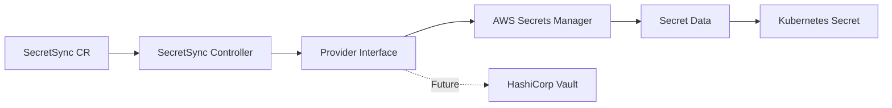
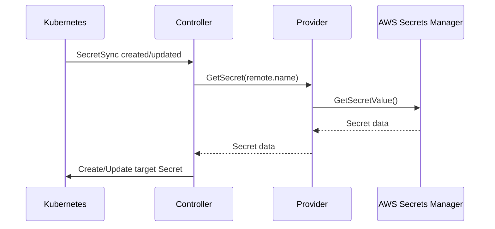
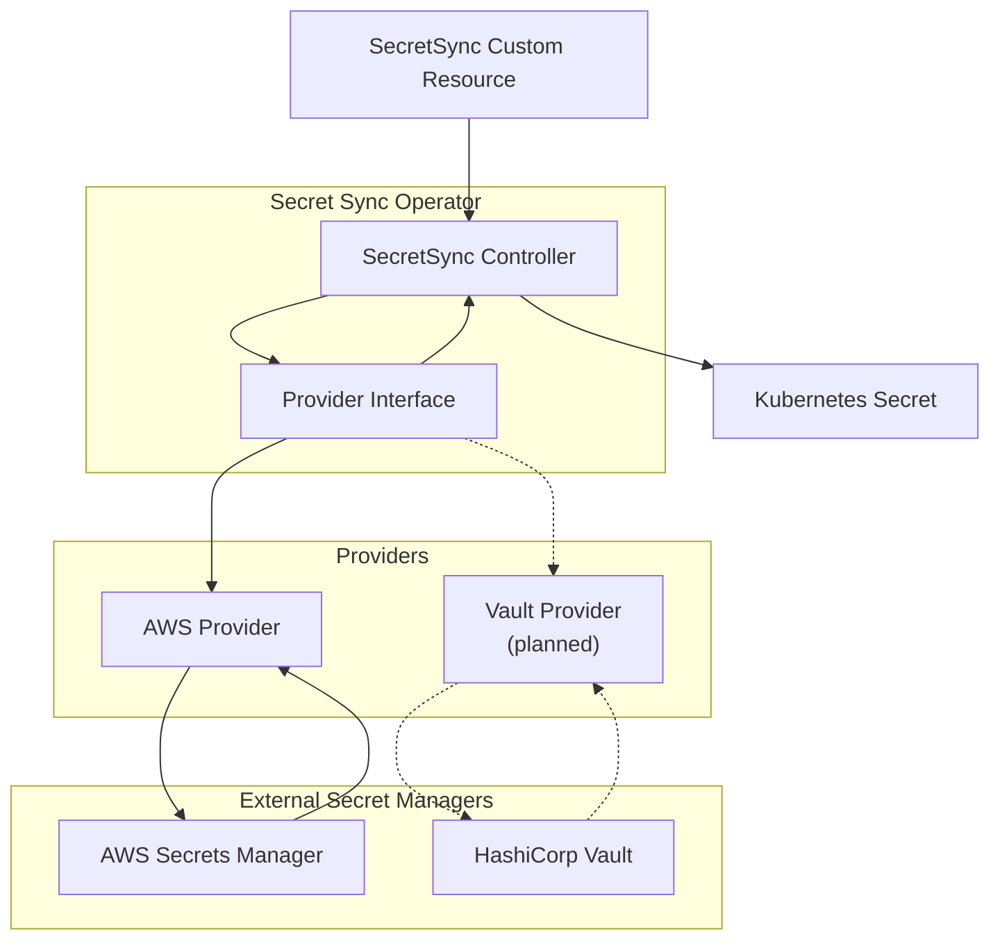
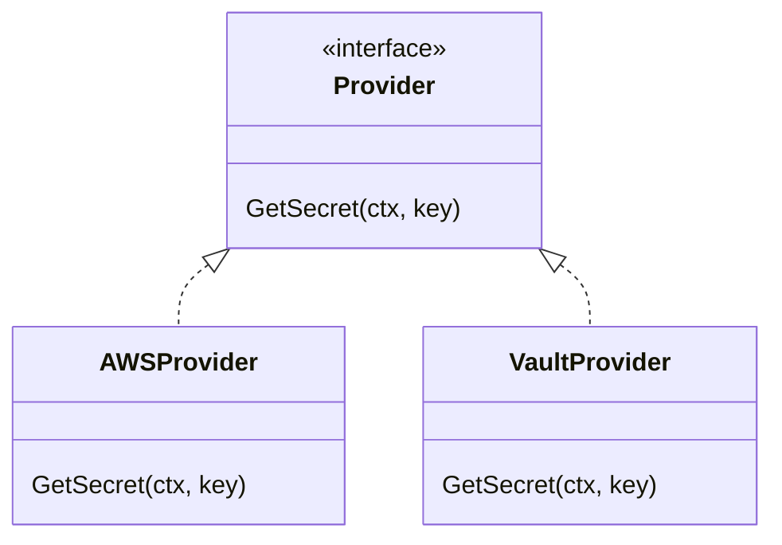
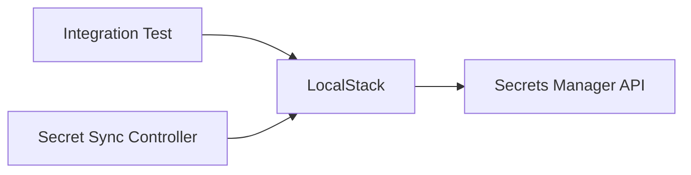
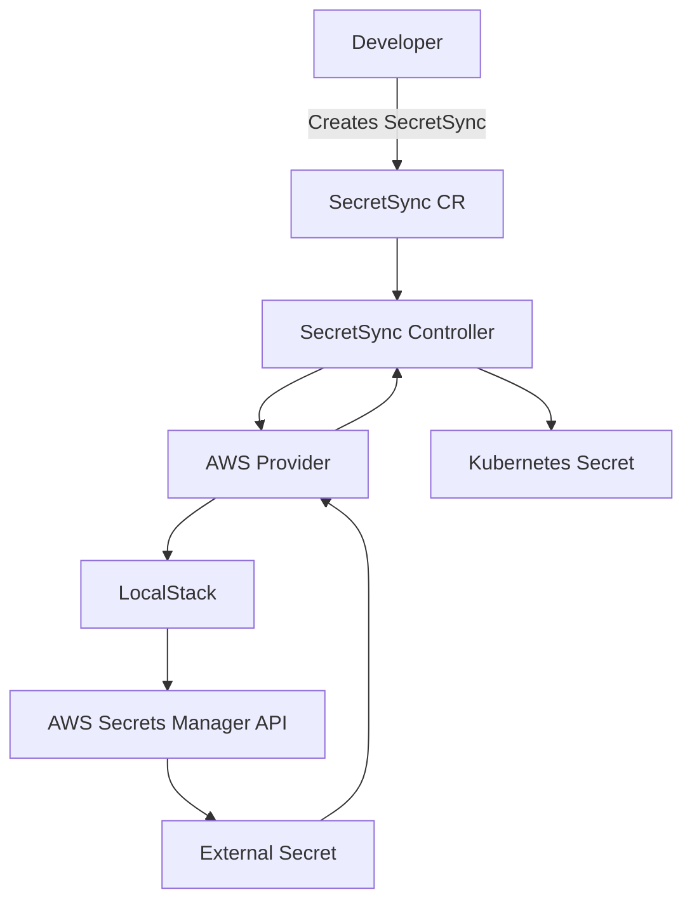
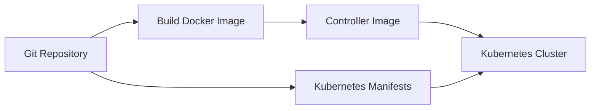

# Secret Sync Operator

A Kubernetes operator that synchronizes secrets from external secret management systems into Kubernetes `Secret` resources.

The project is built with **Go**, **Kubernetes**, and **Kubebuilder**, with a provider abstraction that allows support for multiple external secret providers.

Currently supported:

* **AWS Secrets Manager**
* **HashiCorp Vault** — planned

---

## Overview

The **Secret Sync Operator** watches `SecretSync` custom resources and synchronizes secrets from an external provider into a Kubernetes `Secret`.

The goal is to provide a simple Kubernetes-native way to reference externally managed secrets without storing the original secret values in the `SecretSync` resource.



The controller is designed around a provider interface so that adding another secret management system does not require changing the reconciliation logic.

---

## How It Works

A `SecretSync` resource defines:

1. **Which provider** should be used.
2. **Which external secret** should be retrieved.
3. **Which Kubernetes Secret** should contain the synchronized data.

For example:

```yaml
apiVersion: ops.example.com/v1alpha1
kind: SecretSync
metadata:
  name: database-sync
spec:
  provider:
    type: aws
  remote:
    name: production/database
  target:
    name: database-secret
```

The reconciliation flow is:



---

# Custom Resource

The operator introduces the following custom resource:

```yaml
apiVersion: ops.example.com/v1alpha1
kind: SecretSync
```

### Example

```yaml
apiVersion: ops.example.com/v1alpha1
kind: SecretSync
metadata:
  name: database-sync
  namespace: default
spec:
  provider:
    type: aws
  remote:
    name: production/database
  target:
    name: database-secret
```

### Specification

| Field                | Description                                      |
| -------------------- | ------------------------------------------------ |
| `spec.provider.type` | External secret provider to use                  |
| `spec.remote.name`   | Name/key of the secret in the external provider  |
| `spec.target.name`   | Name of the Kubernetes `Secret` to create/update |

The target Kubernetes `Secret` is created in the **same namespace as the `SecretSync` resource**.

---

# Project Architecture

The project separates Kubernetes reconciliation from provider-specific implementations.



The important design principle is the **provider abstraction**.

The controller does not need to know how AWS Secrets Manager or Vault works. It only interacts with the provider interface.

This makes it possible to add new providers without changing the core reconciliation logic.

---

# Repository Structure

The project follows the standard Kubebuilder layout:

```text
secret-sync-operator/
├── api/
│   └── v1alpha1/
│       ├── secretsync_types.go
│       └── zz_generated.deepcopy.go
│
├── cmd/
│   └── main.go
│
├── config/
│   ├── crd/
│   ├── default/
│   ├── manager/
│   ├── rbac/
│   └── samples/
│
├── internal/
│   ├── controller/
│   │   ├── secretsync_controller.go
│   │   └── secretsync_controller_test.go
│   │
│   └── provider/
│       ├── provider.go
│       ├── aws.go
│       └── aws_test.go
│
├── Dockerfile
├── Makefile
├── Makefile.go.mk
├── go.mod
├── go.sum
└── README.md
```

---

# Provider Interface

The provider layer abstracts access to external secret management systems.

The controller interacts with the provider rather than directly calling AWS, Vault, or another external system.

Conceptually:

```go
type Provider interface {
    GetSecret(ctx context.Context, key string) (map[string][]byte, error)
}
```

The AWS implementation uses the AWS SDK for Go.

Future providers can implement the same interface:



This keeps provider-specific code isolated from the Kubernetes controller.

---

# AWS Secrets Manager

The current implementation supports **AWS Secrets Manager**.

The AWS provider retrieves the secret using the AWS SDK for Go and expects the secret to contain a JSON object.

For example, an AWS Secrets Manager secret could contain:

```json
{
  "username": "admin",
  "password": "example-password",
  "host": "database.example.com"
}
```

The operator converts these values into the Kubernetes Secret's `data` fields.

Conceptually:

```text
AWS Secrets Manager
        │
        │ GetSecretValue
        ▼
{
  "username": "admin",
  "password": "example-password",
  "host": "database.example.com"
}
        │
        │
        ▼
Kubernetes Secret
        │
        ├── username
        ├── password
        └── host
```

---

# Current Limitations

The current AWS provider has some intentional limitations.

### Secret format

The AWS secret must be stored as a JSON object containing string values.

For example:

```json
{
  "username": "admin",
  "password": "secret"
}
```

### `SecretBinary`

The current implementation supports `SecretString`.

`SecretBinary` is not currently supported.

### Authentication

Local development currently uses credentials configured for the LocalStack environment.

Production authentication mechanisms such as AWS IAM roles for service accounts/workload identity can be added as part of a production deployment configuration.

### Providers

Currently only AWS Secrets Manager is implemented.

HashiCorp Vault support is planned.

---

# Prerequisites

For local development, you will need:

* **Go**
* **Docker**
* **kubectl**
* **Kind**
* **AWS CLI** — required for interacting with the LocalStack AWS APIs
* **LocalStack** — required for the local AWS integration test

You should also have a Kubernetes cluster available for deploying the operator.

---

# Local Development

Clone the repository and enter the project directory:

```bash
git clone <repository-url>
cd secret-sync-operator
```

Install Go dependencies:

```bash
go mod download
```

Run the unit tests:

```bash
make test
```

You can also run Go tests directly:

```bash
go test ./...
```

---

# LocalStack

LocalStack is used to provide a local AWS Secrets Manager environment without requiring access to a real AWS account.



Start LocalStack using your preferred LocalStack configuration.

Once LocalStack is running, verify that the Secrets Manager API is available.

Create a test secret:

```bash
aws secretsmanager create-secret \
  --name test-secret \
  --secret-string '{"username":"admin","password":"test-password"}' \
  --endpoint-url http://localhost:4566 \
  --region us-east-1
```

You can retrieve it with:

```bash
aws secretsmanager get-secret-value \
  --secret-id test-secret \
  --endpoint-url http://localhost:4566 \
  --region us-east-1
```

For LocalStack, dummy AWS credentials can be used because no real AWS credentials are required.

For example:

```bash
export AWS_ACCESS_KEY_ID=test
export AWS_SECRET_ACCESS_KEY=test
export AWS_DEFAULT_REGION=us-east-1
```

> **Note:** The LocalStack endpoint configuration in the AWS provider is intended for local development and testing. Production deployments should use the standard AWS endpoint configuration.

---

# Running the Operator with Kind

Create a Kind cluster:

```bash
kind create cluster --name secret-sync-control-plane
```

Build the controller image:

```bash
make docker-build
```

The project currently uses:

```text
controller:latest
```

Load the image into the Kind cluster:

```bash
kind load docker-image controller:latest \
  --name secret-sync-control-plane
```

The image must be loaded into Kind because the cluster needs access to the locally built image.

---

# Deploy the Operator

Deploy the operator using the Kubebuilder manifests:

```bash
make deploy
```

Check that the operator is running:

```bash
kubectl get pods -A
```

You should see the controller pod running.

You can also inspect the controller logs:

```bash
kubectl logs -n secret-sync-operator-system deployment/secret-sync-controller-manager
```

> The exact namespace and deployment name may vary depending on the project configuration.

---

# LocalStack AWS Credentials

When running the controller locally with LocalStack, configure the controller deployment with the LocalStack credentials.

The credentials are intentionally fake:

```text
AWS_ACCESS_KEY_ID=test
AWS_SECRET_ACCESS_KEY=test
```

They are only used to authenticate against LocalStack.

**Do not use these credentials for real AWS resources.**

For a production AWS deployment, the operator should use an appropriate AWS authentication mechanism instead of static credentials.

---

# Create a SecretSync

Create a `SecretSync` resource:

```yaml
apiVersion: ops.example.com/v1alpha1
kind: SecretSync
metadata:
  name: database-sync
spec:
  provider:
    type: aws
  remote:
    name: test-secret
  target:
    name: database-secret
```

Save the file and apply it:

```bash
kubectl apply -f config/samples/ops_v1alpha1_secretsync.yaml
```

Check the resource:

```bash
kubectl get secretsync
```

Then check the generated Kubernetes Secret:

```bash
kubectl get secret database-secret
```

---

# Verify the Secret

You can inspect the generated Secret:

```bash
kubectl get secret database-secret -o yaml
```

Kubernetes stores Secret values as base64-encoded data.

For example:

```bash
kubectl get secret database-secret \
  -o jsonpath='{.data.username}' | base64 --decode
```

---

# End-to-End Flow

Once everything is running, the complete local flow looks like this:



The important part is that the secret value itself is **not stored in the `SecretSync` resource**.

The `SecretSync` only describes where the secret should come from and where it should be synchronized.

---

# Testing

Run all tests:

```bash
make test
```

Or:

```bash
go test ./...
```

The provider package contains unit tests for the AWS implementation.

The AWS provider uses an interface around the AWS Secrets Manager client so that the provider can be tested without requiring a real AWS environment.

The project also includes a LocalStack integration test for testing the AWS Secrets Manager interaction locally.

If LocalStack is not running, the LocalStack integration test should be skipped.

---

# Building the Container Image

The operator is packaged as a container image.

The `Dockerfile` builds the Go application and produces the controller image used by Kubernetes.

Build the image with:

```bash
make docker-build
```

The resulting image is:

```text
controller:latest
```

For local Kind development, load the image into the cluster:

```bash
kind load docker-image controller:latest \
  --name secret-sync-control-plane
```

The Kubernetes deployment uses:

```yaml
image: controller:latest
imagePullPolicy: IfNotPresent
```

This allows Kubernetes to use the image loaded directly into the Kind node instead of trying to pull it from a remote registry.

---

# Distribution

At the moment, the project is intended primarily as a source-based project.

A user can clone the repository, build the container image, and deploy the Kubernetes manifests.

The basic flow is:



A future release can publish versioned container images to a container registry.

For example:

```text
secret-sync-operator:v0.1.0
secret-sync-operator:v0.2.0
```

This would allow users to deploy the operator without building the image themselves.

---

# Future Roadmap

Planned improvements include:

* [ ] Add HashiCorp Vault provider
* [ ] Improve provider configuration
* [ ] Add stronger reconciliation/status reporting
* [ ] Improve error handling and retry behavior
* [ ] Add more integration tests
* [ ] Improve authentication configuration for production AWS environments
* [ ] Publish versioned container images
* [ ] Improve installation/distribution experience
* [ ] Consider Helm-based installation

The roadmap may evolve as the project develops.

---

# Why This Project?

This project was created as a practical exercise in building a Kubernetes operator with Go.

It provides experience with:

* **Go**
* **Kubernetes controllers**
* **Custom Resource Definitions (CRDs)**
* **Kubebuilder**
* **Kubernetes reconciliation**
* **AWS Secrets Manager**
* **AWS SDK for Go**
* **Docker**
* **Kind**
* **LocalStack**
* **Kubernetes RBAC**
* **Provider abstractions**
* **Unit and integration testing**

The project also demonstrates how external infrastructure services can be integrated into Kubernetes through a custom controller.

---

# Contributing

Contributions and suggestions are welcome.

If you would like to contribute:

1. Fork the repository.
2. Create a feature branch.
3. Make your changes.
4. Add or update tests where appropriate.
5. Run the test suite.
6. Open a pull request.

Before submitting changes, make sure the project builds successfully and the tests pass:

```bash
make test
```


